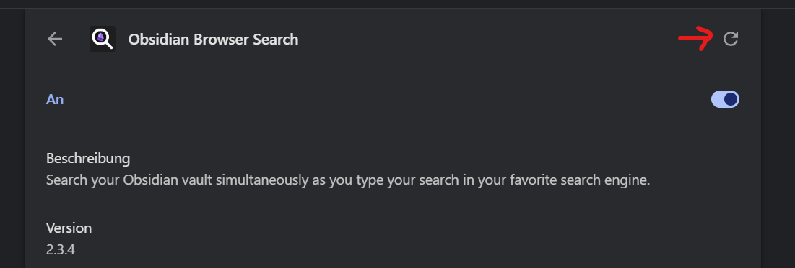

# FAQ and Troubleshooting

> [!warning] Work in Progress 🏗️
> This page is a work in progress. If you don't find an answere to your questions here or in the [guide](./feature-guide.md), feel free to [reach out](https://jakobosterberger.com/contact) or to open up an [issue on github](https://github.com/jk-oster/obsidian-search-for-web/issues)!

> Thanks [@coddingtonbear](https://github.com/coddingtonbear) for inspiration and already written awesone guides on how to tackle certain issues.

## How can I troubleshoot connection problems between Obsidian Browser Search and Obsidian Local REST API?

In general, connection between Obsidian Browser Search and the Obsidian Local REST API are quite simple to set up. Usually it is just a matter of entering the API Key in the correct field, but sometimes things don't go smoothly.

See [this discussion](https://github.com/coddingtonbear/obsidian-web/discussions/174#discussioncomment-8740665) by [@coddingtonbear](https://github.com/coddingtonbear) for steps you can take to troubleshoot connection errors.

## How do I get my browser trust my Obsidian Local REST API certificate?

[@coddingtonbear](https://github.com/coddingtonbear) has written an [extensive guide](https://github.com/coddingtonbear/obsidian-web/wiki/How-do-I-get-my-browser-trust-my-Obsidian-Local-REST-API-certificate%3F) about this issue. Look it up to find out how to get it to work.

## How do I ask Chrome to update extensions immediately?

Chrome will automatically update extensions as updates are approved via the Chrome Web Store review process, but that takes time. If you know the version shown on the Chrome Web store (see [here](https://chromewebstore.google.com/detail/obsidian-browser-search/ikdemlfoilfdmcdiegelchlhfnkpmaee)) is newer than the version you currently have installed, you can easily tell your browser to download updates immediately.

To do that:

1. Go to [chrome://extensions/](chrome://extensions/)
2. Click the "Update" button shown near the upper-left corner of the browser window.



Done!

## How do I test the latest extension version from Github?

The latest development [releases are available on Github](https://github.com/jk-oster/obsidian-search-for-web/releases). You can try them out already before they will be published in the Chrome Web Store and use new Features earlier.

0. open your obsidian vault in the app and install either the local REST API plugin or the omnisearch plugin
1. test this extension by downloading the [latest released](https://github.com/jk-oster/obsidian-search-for-web/releases) zip file
2. extract the files
3. [install the folder from the chrome extension tab](https://bashvlas.com/blog/install-chrome-extension-in-developer-mode/)
4. open the settings tab of the extension
5. configure your search provider and input vault name in the settings
6. go to any webpage and see the number of matching notes in the extension icon

## Is Obsidian Browser Search also available for Firefox?

**Short answer**: Not yet.

**Long answer**: For now the extension is being developed and tested for Chrome on Windows only. By using the [webextension-polyfill](https://github.com/mozilla/webextension-polyfill) library of mozilla.org it is aiming for Firefox compatibility. However, there are still a few things to clear up and implement before Firefox is fully supported.

## How do I build my own version of Obsidian Brwoser Search?

### For the Webdevelopers

Clone the repository, install dependencies `npm install` (or better use `pnpm install`) and run `npm run dev` / `pnpm dev`. This should automatically start chrome with the extension installed.

### New to Programming?

If you're wondering how to build and test your own modifications to this extension — great! That curiosity is exactly what you need.

For experienced developers, the above may be obvious, but if you're new to programming, here’s something important to remember: nobody gets it right on the first try. The key is setting up a solid development workflow with a tight feedback loop — the faster you can test your changes, the easier it is to refine them.

Once your development setup is running, you can start making changes, testing them, and iterating as needed (which will likely be many times).

#### Setting Up a Development Build

To get started, you’ll need:

- A compatible version of Node.js
- All necessary dependencies
- A way to build the extension
- A method to load it into your browser
- The ability to iterate—keep making changes until they work as intended

With this setup, you'll be able to experiment efficiently and improve your extension with confidence.

##### Getting a compatible version of Node

You need node Version ``>=18``. Probably the easiest way to install it is using https://asdf-vm.com/.

##### Installing necessary dependencies

Clone the repository using ``git``. Then run the installation command in the project folder:

```bash
npm install
```

This will download an install all code dependencies into the ``node_modules` folder.

##### Building the Project

Run the following command to perform the build process.

```bash
npm run dev
```

Whenever you make changes to any files this will rebuild the project into the folder ``dist/``

If you have Chrome installed this will automatically launch a Browser Window with the extension installed.

You have now loaded the extension so you can try out your changes to see if they work!

##### Iterate = Debugging and Refreshing Your Changes

Computers require precision and perfection—something humans achieve only through trial and error. Expect to make multiple adjustments before getting things right.

###### The Good News

Most of the time, your changes will be automatically detected by the build script. Simply refresh the page and interact with the extension button to see your updates applied—this works for modifications to the popup or options page.

###### The Bad News

If you modify the service worker or any files it depends on, a simple refresh won’t be enough. You’ll need to manually update the extension:

1. Go to [chrome://extensions/](chrome://extensions/)
2. Locate your development version (it typically has a red background)
3. Click "Update" to reload the background process with your changes

This ensures your latest updates take effect properly.
