# Feature Guide

> [!warning] Work in Progress 🏗️
> This page is a work in progress and does not include all the features yet!

## Connection Indicator <Badge type="tip" text="^1.0.0" />

When the extension could establish a successful connection with your Obsidian search provider the extension icon will have a green or no indicator attached (see Indicator on successful connection below).

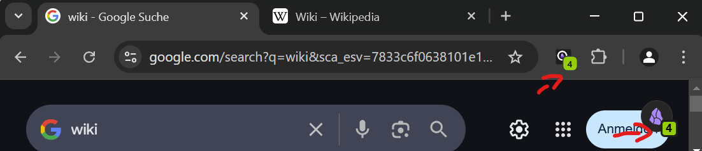


If the extension could not reach Obsidian then there will be a gray indicator visible next to the extension icon (see indicators on disconnection or error below).

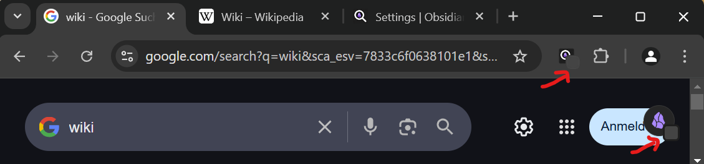

To get more information about why the extension could not reach Obsidian open the sidebar or the extension settings (see sidebar when disconnected below).

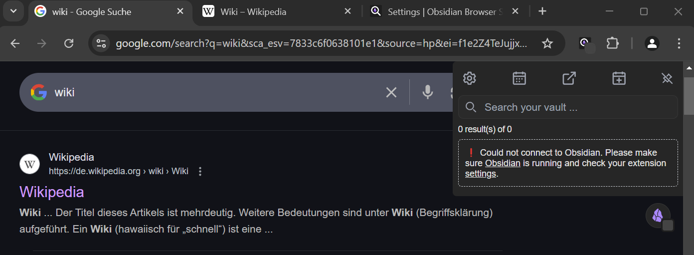

In case of connection issues refer to the [FAQ](./faq.md#how-can-i-troubleshoot-connection-problems-between-obsidian-browser-search-and-obsidian-local-rest-api) or read up on [configuring the extension](./getting-started.md).

## 📑 Sidebar <Badge type="tip" text="^1.0.0" />

The sidebar is always reachable on any webpage you browse.
In it you find search [results matching the page](#⚡-instant-live-search), [quick access to daily notes](#📅-daily-note-quick-access) and options and the search bar. You can also use it to type a search query directly in the sidebar.

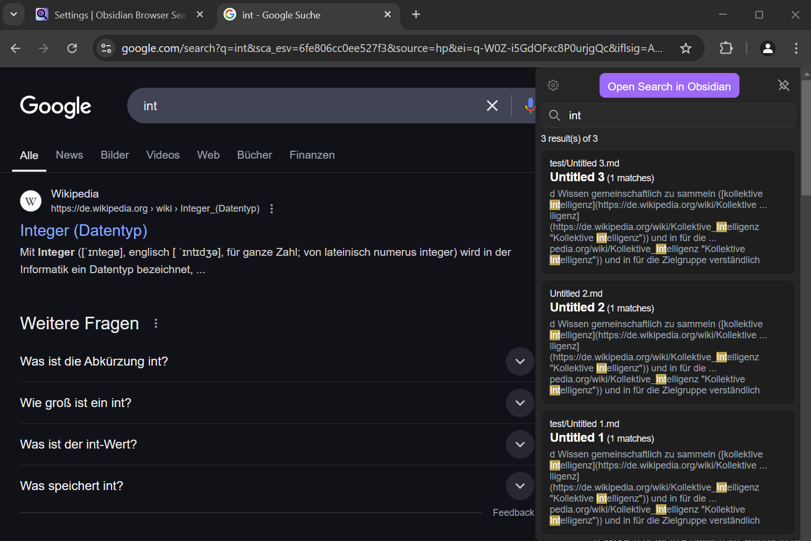

### Opening the Sidebar

By default, the extension sidebar can be opened by hovering the extension icon on the page.
As soon as you leave the extension sidebar with your mouse again it will be hidden again.

### Pinning the Sidebar <Badge type="tip" text="^2.0.0" />

You can keep the sidebar permanently opened by "pinning" it. You can toggle the "pinned"/"unpinned" states by clicking
the button in the sidebar header, clicking the extension icon in the browser toolbar or by clicking the extension icon on the page.

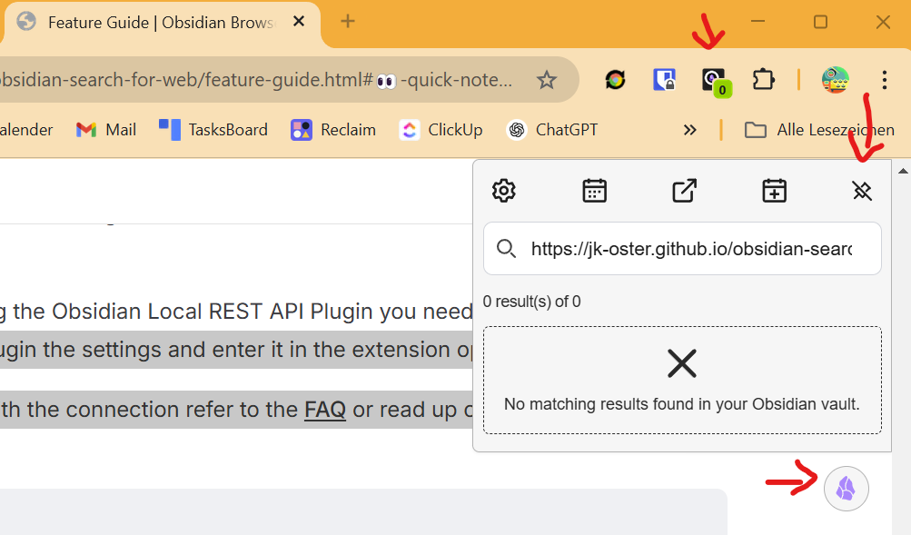

## ⚡ Instant Live Search  <Badge type="tip" text="^1.0.0" />

The core feature of this extension is the live search. As you type your search in a search engine the extension will fetch the search results from your Obsidian Vault and display them in the sidebar. The search results are updated as you type and you can scroll through them to find the note you are looking for.

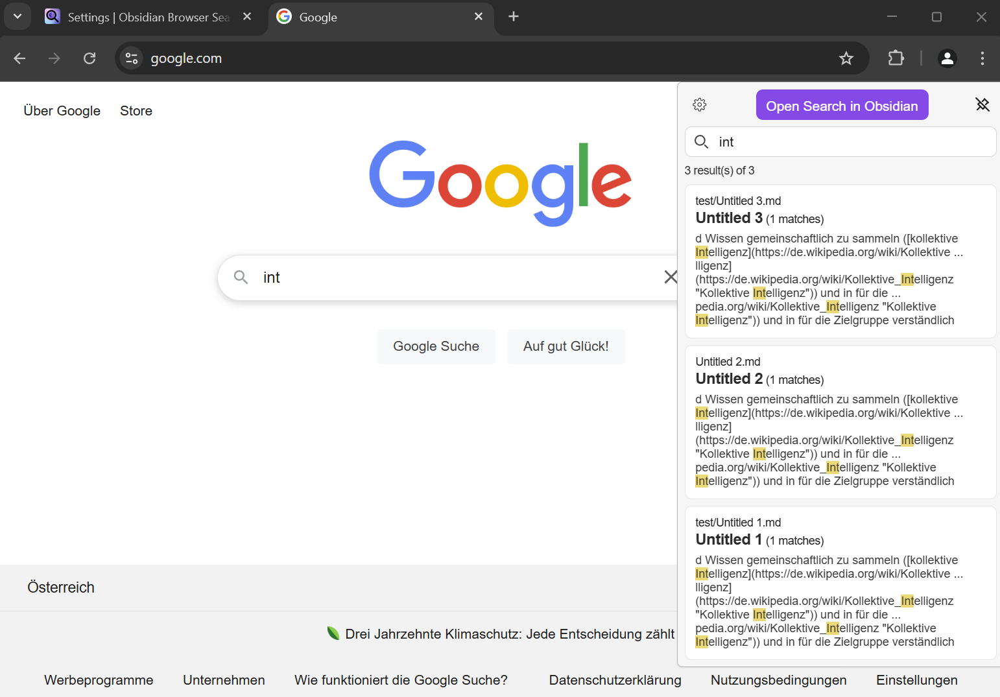

You can configure live search behavior in the extension settings. You can choose the domains on which the extension should look for search input and trigger the live search. All other pages will be matched by URL instead of search input.

The extension automatically recognizes the following **live search domains** without any additional configuration:

- google.com
- bing.com
- kagi.com
- duckduckgo.com
- baidu.com
- search.brave.com
- startpage.com
- search.yahoo.com
- qwant.com
- ecosia.org
- yandex.com

## 💡 Note Recall / URL Matching  <Badge type="tip" text="^1.0.0" />

If you are currently on a page and you have saved its URL somewhere in your Obsidian Vault, the extension will automatically show you all notes that mention that URL in the sidebar. This feature is particularly helpful for locating notes tied to specific websites. Or if you want to see if you have already taken notes on a page you are currently reading. The URL matching is only triggered if the current page does NOT match a configured [**live search domain**](#⚡-instant-live-search).

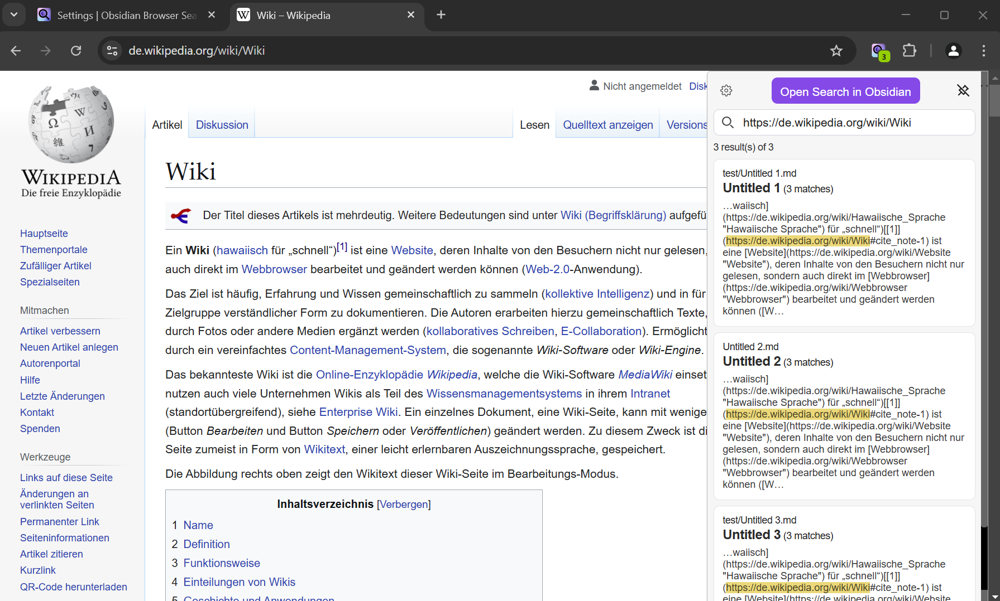


## 🖥️ Embedded Search Results <Badge type="tip" text="^1.4.0" />

> [!info] Info
> Be aware that this feature can potentially break if the search engines change their layout or general structure of their search pages. The extension tries to be up-to-date on these changes. However, it can not be guaranteed.

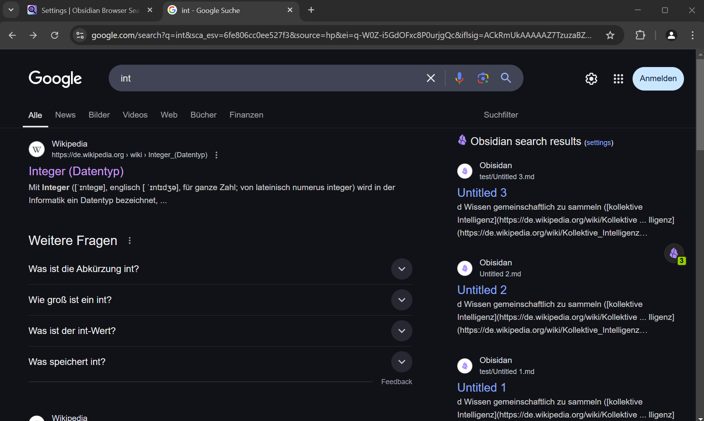

This extension supports embedded search results on the following search engines:
- google.com (native styled embeddings)
- bing.com (native styled embeddings)
- kagi.com (native styled embeddings)
- duckduckgo.com (native styled embeddings)
- baidu.com (generic embeddings)
- search.yahoo.com (generic embeddings)
- qwant.com (generic embeddings)
- ecosia.org (generic embeddings)
- yandex.com (generic embeddings)

If the extension detects that a the user is on one of those search engines it will automatically embed the search results in the search page sidebar or main content block. Embedded search results can be toggled on or off in the settings.

Evaluated and not supported are:
- search.brave.com
- startpage.com

### Generic vs Native Embeddings

... coming soon ...


## 👀 Quick Note Preview <Badge type="tip" text="^2.1.0" /> <Badge type="warn" text="* Local REST API required" />

Upon clicking a search result the note will be opened in the preview panel. This way you can view your notes and open them directly in your browser without switching context.

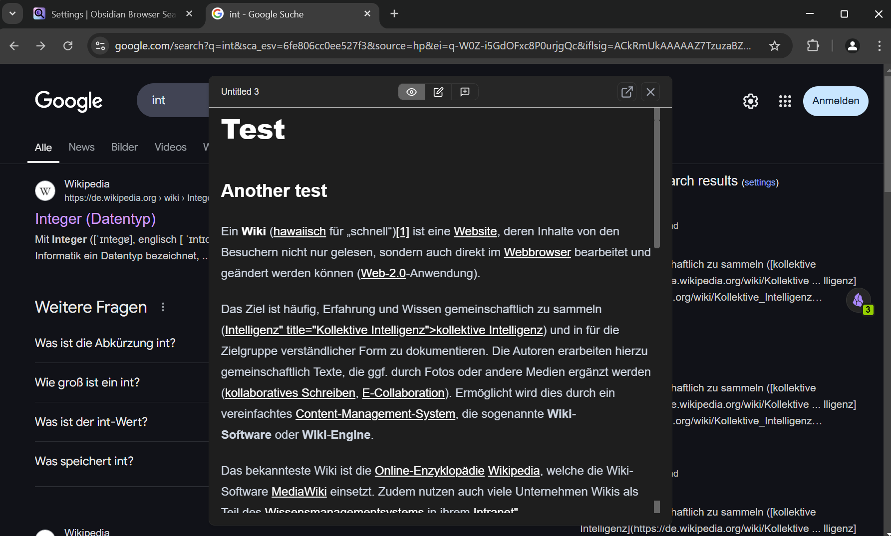

## ✒️ Note Editing <Badge type="tip" text="^2.1.0" /> <Badge type="warn" text="* Local REST API required" />

> [!danger] ⚠️ Warning
> Saving the note content using the "Edit" mode overwrites the whole file content in Obsidian. This could potentially lead to loss of data. Always make sure to backup your vault! Better be safe than sorry - you are responsbile for your own notes.

Opened notes can be edited by clicking the "Edit" button in the preview panel. A [codemirror](https://codemirror.net/) view of your note will be loaded in which you can conviniently change the content of your note. The edited content will be saved automatically if the panel is closed with the "X"-close button or when the mode is changed to "Preview" or "Append". Additonally a "Save" button will be visible if the edited content differs from the current note content.

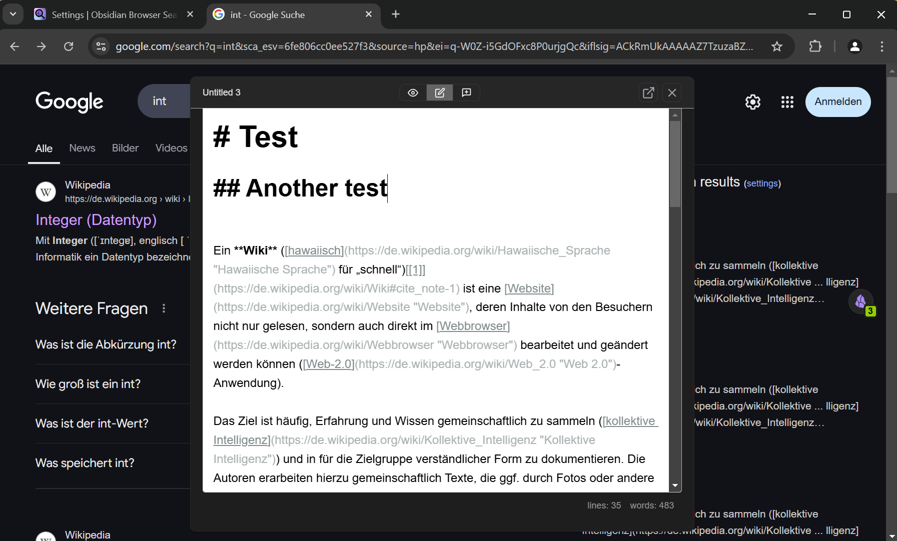

### Appending Content <Badge type="tip" text="^2.1.0" /> <Badge type="warn" text="* Local REST API required" />

To quickly append content without editing the whole note you can click the "Append" button in the preview panel.
Type your quick notes there and save them to your vault.

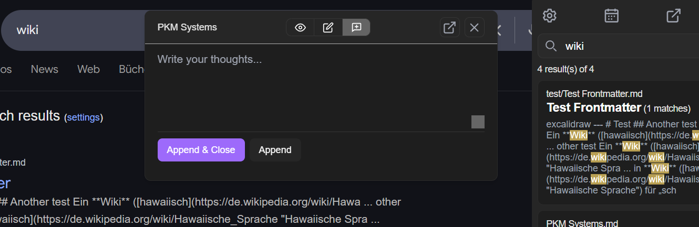

## 🌔 Adaptive Dark / Light Mode <Badge type="tip" text="^2.1.0" />

The extension has four theme modes: ``auto``, ``device``, ``light`` and ``dark``.

In "auto" mode the extension tries to auto detect the current color scheme of the page. Depending on the brightness it will choose the best fitting color scheme.

In "device" mode it will use the device color scheme preference for the sidebar and auto detection for embedded content.

If "light" or "dark" mode are selected then the respective color scheme is enforced no matter the page background or device preferences.

## 🔍 Configurable Search

... details coming soon ...


## 📅 Daily Note Quick Access  <Badge type="tip" text="^2.2.0" /> <Badge type="warn" text="* Local REST API required" />

You can quickly open up your current daily note in "Preview" mode or if you just need to quickly jot down something you can use the "Append" mode.
For both modes there are dedicated buttons in the sidebar menu.

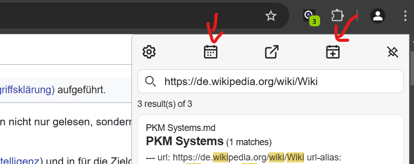

### Choose time periods <Badge type="tip" text="^2.3.4" /> <Badge type="warn" text="* Local REST API and Periodic Notes required" />

If you want to open up a note of a different time period you need to install the [Periodic Notes Plugin](obsidian://show-plugin?id=periodic-notes) and enable the respective periods in the plugin settings. Then choose one of the options ("daily", "weekly", "monthly", "quaterly" or "yearly") in the extension settings.


## 🗒️ Page Notes <Badge type="tip" text="^2.2.0" /> <Badge type="warn" text="* Local REST API required" />

> This feature is heavily inspired by [Obsidian Web](https://github.com/coddingtonbear/obsidian-web) (a lot of kudos!) and aims for compatibility while adding a few nice add-ons.

For many features of Obsidian Browser Search, it can be helpful to associate a particular URL or set of URLs with a note. To establish this connection, you can use the ``url`` or ``url-aliases`` frontmatter fields as described below. Once you have done so and you navigate to a URL you have created notes for, Obsidian Browser Search will suggest the linked note to you and, if enabled, show you a notification message (see image below). Clicking the message opens up the related note in the [preview panel](#👀-quick-note-preview).

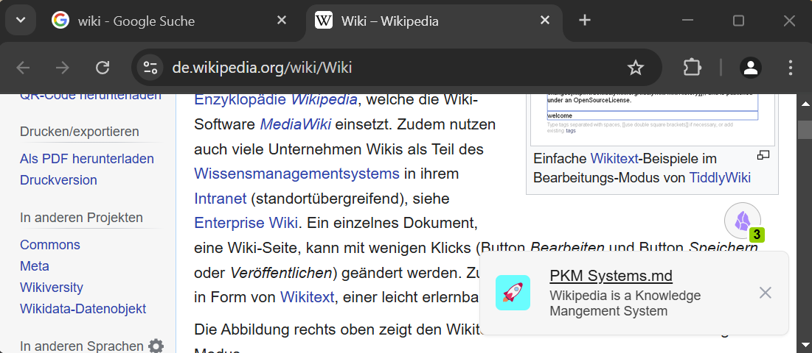


```yaml
---
url: https://www.amazon.com/Zenkeeper-Obsidian-Tumbling-Meditation-Sculpture/dp/B08L3LWVKV/*
---
```

The ``url`` / `link` field also supports using the ``*`` symbol as a wildcard so you can match multiple URLs. You can see this in use in the above example so that we match that URL regardless of what parameters are added to the URL.

In some cases, you might need a particular note to be responsible for multiple URLs, if so, you can put any number of URLs in the ``url-aliases`` / `link-aliases` field:

```yaml
---
url-aliases:
  - https://livethedraper.com/*
  - https://www.apartments.com/5035-n-broadway-st-chicago-il/1gh5s77
  - https://www.google.com/maps/place/The+Draper+-+Uptown/*
---
```

Like ``url`` above, this supports using the ``*`` character for matching multiple URLs. For details on the use and support of frontmatter fields read [this page](./frontmatter-fields.md).

## 🔗 Link Hover Messages <Badge type="tip" text="^2.2.0" /> <Badge type="warn" text="* Local REST API required" />

> This feature is heavily inspired by [Obsidian Web](https://github.com/coddingtonbear/obsidian-web) (a lot of kudos!) and aims for compatibility while adding a few nice add-ons.

You can configure Obsidian Browser Search to notify you when the link you are hovering over has a dedicated note (see Page Notes above) or has been mentioned on a note. Once enabled and you hover over such a link, a message will be displayed next to your mouse cursor (see image below). Clicking the message opens the note in the [preview panel](#👀-quick-note-preview) if available.

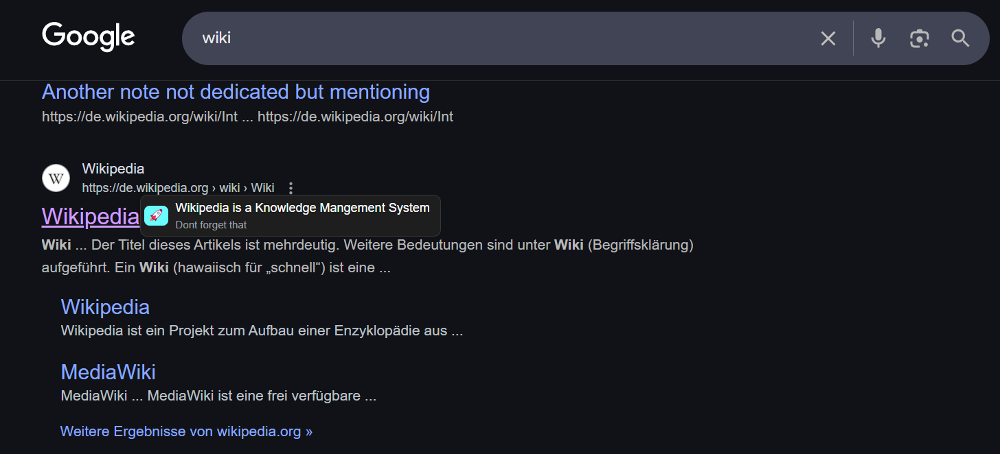

Some frontmatter fields can be used to control what information is shown in this message:

- ``web-message``: This message will be displayed in the hover and page note message.
- ``web-badge-color``: By default, there is no badge color show. You can set this color explicitly by setting this color; see [Special Frontmatter Fields](./frontmatter-fields.md) for more information.
- ``web-badge-icon``: You can define an emoji / text that will be displayes inside the badge.
- ``web-badge-message``: This short message will be displayed in the hover message alongside the longer web-message.

For details and examples of the use of frontmatter fields read the [Special Frontmatter Fields page](./frontmatter-fields.md).

## ⭐ Choose Search Provider <Badge type="tip" text="^1.4.0" />

To fetch search results from your Obsidian Vault you can choose between the Obsidian Local REST API Plugin or the Omni Search Plugin. The extensions requires one of these plugins to be installed and enabled in your Obsidian Vault.

If you use the Omni Search Plugin make sure to enable the HTTP Server API in the settings of the plugin.

In case you are using the Obsidian Local REST API Plugin you need to copy the API-Key from the obsidian plugin the settings and enter it in the extension options.

In case of troubles with the connection refer to the [FAQ](./faq.md#how-can-i-troubleshoot-connection-problems-between-obsidian-browser-search-and-obsidian-local-rest-api) or read up on [configuring the extension](./getting-started.md).

> [!info]
> If you want to use the **Note Preview**, **Editing**, **Daily Note Quick Access** and **Page Notes** features the [Obsidian Local REST Api](obsidian://show-plugin?id=obsidian-local-rest-api) is **required**.
> You can also use both plugins simultaneously. The extension allows you to use Omnisearch for search results and REST Api for the note preview at the same time. *Best of both worlds 🤩*

> [!tip]
> If you work with non-Latin scripts such as Chinese or Japanese, consider using the Obsidian Local REST API Plugin for better search results.

---

> [!important] Disclaimer
> This is an unofficial browser extension for Obsidian. The project is not sponsored, endorsed or affiliated with Dynalist Inc, the makers of [Obsidian.md](https://obsidian.md). The obsidian logo is property of https://obsidian.md.
