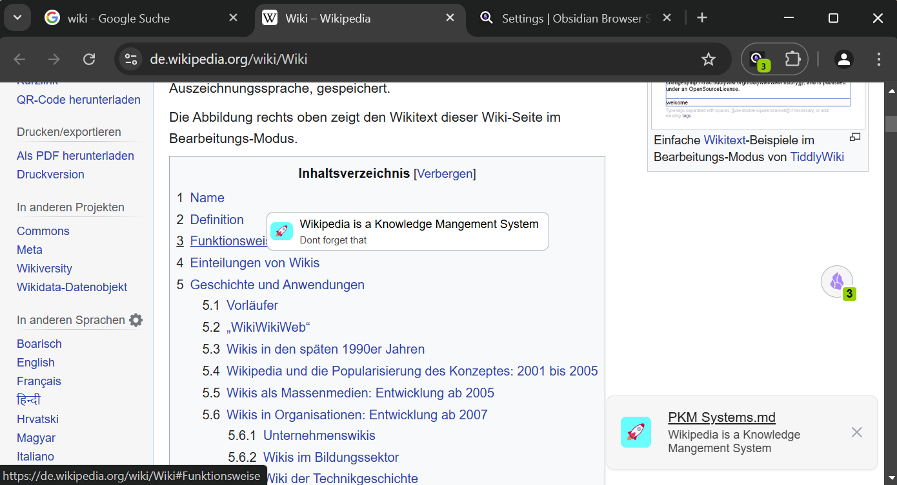

# Special Frontmatter Fields

> This feature is heavily inspired by [Obsidian Web](https://github.com/coddingtonbear/obsidian-web) (a lot of kudos!) and aims for compatibility while adding a few nice add-ons

Obsidian Browser Search treats a few frontmatter fields in a special way. You can find here what each of these fields are used for.

The two most important frontmatter fields are ``url`` and ``url-aliases``. These two fields mark a particular note as being associated with the specified URLs:

| Field Name                       | Type | Description                                                            |
| -------------------------------- | ---- | ---------------------------------------------------------------------- |
| ``url`` / `link`                 | Text | Marks this note as being "owned" by the specified URL                  |
| ``url-aliases`` / `link-aliases` | List | Like url, marks the the note as being "owned" by all URLs in this list |

See Page Notes for more information about how the ``url`` and ``url-aliases`` fields work.

Once a note is associated with a particular URL, there are a few other fields you can set on the same note that can be used for controlling what Obsidian Browser Search shows you when you land on the URL or when you hover a link to it:

| Field Name            |    Type |   Description                                                                                                               |
| --------------------- | ------- | --------------------------------------------------------------------------------------------------------------------------- |
| ``web-badge-color``   |   Text  |   The color, as a hexadecimal value, to use as the background for the hover badge and Page Note notification   |
| ``web-badge-message`` | Text    |   A short message to show on the hover badge; see ``web-message`` for an additional option                         |
| ``web-badge-icon``    |    Text |   An emoji to show in the hover badge and Page Note notification |
| ``web-message``       |   Text  |   A message you would like to display when landing on the specified URL (Page Note notification), also shown in the hover badge                                                    |


See above for more information about how each of these frontmatter fields are used for particular features.

## Example

```yaml
---
url: https://de.wikipedia.org/wiki/Wiki
url-alias: https://de.wikipedia.org/wiki/*
web-badge-message: Dont forget that
web-badge-color: 05fefe
web-message: Wikipedia is a Knowledge Mangement System
web-badge-icon: 🚀
---
```

The above frontmatter produces the following messages / notifications.


