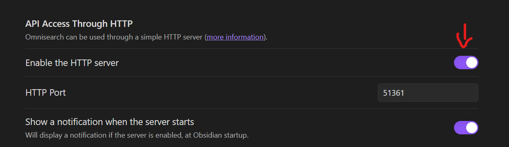
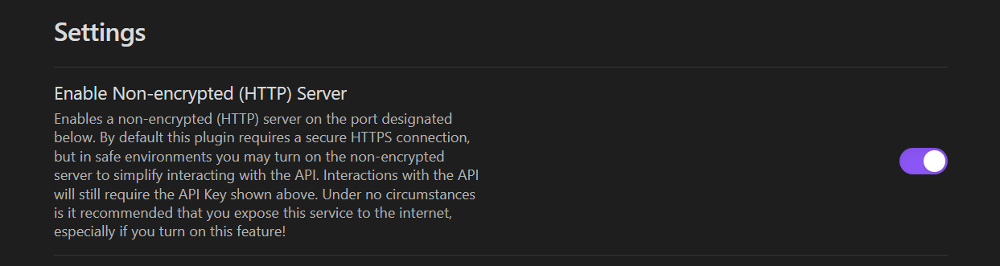

# Setup

Follow these quick instructions to start using the [Vault Lens](https://vaultlens.com) extension in just a minute.

## Pre-Requisites

Install at least one of the two following Obsidian Plugins in your vault:
- [Obsidian Local REST Api](obsidian://show-plugin?id=obsidian-local-rest-api)
- [Obsidian Omnisearch](obsidian://show-plugin?id=omnisearch)

> [!info]
> If your want to use advanced features like **Note Preview**, **Editing**, **Daily Note Quick Access** and **Page Notes** feature the [Obsidian Local REST Api](obsidian://show-plugin?id=obsidian-local-rest-api) is required.
> However, you can also use both plugins simultaneously. The extension allows you to use Omnisearch for search results and REST Api for the other features at the same time.

> [!tip]
> If you work with non-Latin scripts such as Chinese or Japanese, consider using the [Local REST Api Plugin](obsidian://show-plugin?id=obsidian-local-rest-api) for better search results.

### Plugin Configuration

Make sure your preferred search plugin(s) are **enabled**. When using Omnisearch the **HTTP Server** must be **activated** in Omnisearch settings as shwon below. 

If you want to use Local REST API and you simply use it locally on your PC over `http` activate the option **Enable Non-encrypted (HTTP) Server** in the plugin settings as shown below. 

If you want to use ``https`` with Local REST API follow [this guide by @coddintonbear](https://github.com/coddingtonbear/obsidian-web/wiki/How-do-I-get-my-browser-trust-my-Obsidian-Local-REST-API-certificate%3F) to enable it and install the necessary certificates.

## Installation

Download and install the extension:
- for Chrome, Edge, Brave, Opera or Arc users from the [Chrome Web Store](https://chromewebstore.google.com/detail/vault-lens/ikdemlfoilfdmcdiegelchlhfnkpmaee)
- for Firefox from the [Mozilla Add-on Store](https://addons.mozilla.org/de/firefox/addon/vault-lens/)
- for Edge from the [Microsoft Edge Add-on Store](https://microsoftedge.microsoft.com/addons/detail/vault-lens/famedkcjbljkkabgpphnioagamckhmcj)

## Browser Extension Configuration

When you install the Extension for the first time the **Options page** should automatically open up. If this is not the case you can reach the options page though the extension settings of your browser or through the extension sidebar.

On the extension Options page scroll down to "Obsidian Connection".

1. Choose your favorite Search Provider plugin
2. Make sure the Obsidian App is running and your search provider Plugin(s) are enabled
3. Configure the "Protocol" and "Port" settings to match the respective obsidian plugin configuration.
   - For **Omnisearch Default**: Protocol = `http`, Port = `51736`
   - For **Local REST Api**:
      - Protocol = `http`, Port = `27123`
      - Protocol = `https`, Port = `27124`
      - make sure to set the "API-Key"
4. The extension will try to connect to your search provider and lets you know via a toast message once connection has been established.

*✅ Everything set up! Happy browsing and note-taking while using the extension*

_(Optional)_ Have a look further down to the "Display Settings" to explore and fine tune to your preferences.

## Basic Usage Example

Go [google.com](https://google.com) and type a search for a phrase or word that is mentioned somewhere in your Obsidian Notes.
- Now you should see an icon on the right page side with a green indicator of how many search results are available.
- Hover or click the icon to open the extension sidebar to see the notes found related to your search.
- If no results are available there will be no green indicator but only the icon.
- Clicking a note title will now open the note preview (if you are using Obsidian REST Api) or open the note directly in your Obsidian app.
