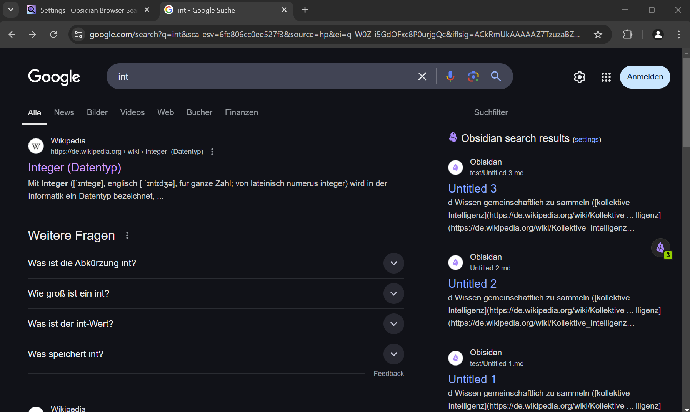

---
# https://vitepress.dev/reference/default-theme-home-page
layout: home

hero:
  name: "Obsidian Browser Search"
  text: "Connect your Vault to the Web"
  # text: "Connect Obsidian to your Browser"
#  text: "Your Webclipper Companion"
  tagline: Search your Obsidian vault simultaneously as you type your search in your favorite search engine.
  actions:
    - theme: brand
      text: Install now
      link: https://chromewebstore.google.com/detail/obsidian-browser-search/ikdemlfoilfdmcdiegelchlhfnkpmaee
    - theme: alt
      text: Getting Started
      link: /getting-started
    - theme: alt
      text: Feature Guide
      link: /feature-guide

features:
  - title: Instant Live Search
    icon: ⚡
    details: Find your notes in a flash—just start typing, and results appear instantly, also on your favorite search engine.
  - title: Note Recall
    icon: 💡
    details: Automatically surface relevant notes when you visit websites you already mentioned in your notes.
  - title: Effortless Sidebar Access
    icon: 📑
    details: Your notes, always within reach. A collapsible sidebar lets you browse and search without switching tabs.
  - title: Adaptive Dark & Light Mode
    icon: 🌔
    details: Seamlessly matches the theme of the page you are browsing for a distraction-free experience.
  - title: Choose Search Provider
    icon: ⭐
    details: Choose how you search — integrates with Omnisearch and Obsidian REST API plugin.
  - title: Embedded Search Results
    icon: 🖥️
    details: See relevant Obsidian notes directly within your e.g. Google / Bing / ... searches.
  - title: Quick Note Previews
    icon: 👀
    details: Preview your notes and open them directly in your browser without switching context.
  - title: Configurable Search
    icon: 🔍
    details: Exclude files and folders you don't want to show show up in the search results.
  - title: Daily Note Quick Access
    icon: 📅
    details: Open yopur daily note with one click or append content to it on the fly.
---

> [!important] Disclaimer
> This is an unofficial browser extension for Obsidian and it is not connected to the developers of the app. The project is not sponsored, endorsed or affiliated with Dynalist Inc, the makers of [Obsidian.md](https://obsidian.md). The obsidian logo is property of https://obsidian.md.

## Screenshot Instant Live Search

## Screenshot Search Embeddings

# Screenshot Page Note Notifications

